<a name="sensor"></a>
## Sensor
[Back to contents](#contents)

###Description

The sensor samples sound every minute. The microphone in the sensor starts collecting sound data every minute it produces data that represents a sine wave. The data is then put through an ADC (Analogue to Digital Converter) that amplifies the analogue data (sine wave) and removes any voltage noise. It is then analysed by the sensor, taking fifty points along the wave, in this minute time period, to find the amplitude of the wave (how loud the sound is).  

The final sensor is comprised of multiple parts, [Microphone](#mic), [ADC](#adc), [Board](#sensor_board), [Clock](#sensor_clock), [Battery](#battery), [XBee](#sensor_xbee), [Case](#sensor_case):

*<a name="mic"></a>Microphone*

The microphone is an electret microphone with a built in MAX4466 amplifier. This amplifier has adjustable gain which is used to boost the raw signal which is passed from the microphone. In the final version of this sensor we decided that this amp was not enough and that we needed to add another amplifier to the circuit to improve our recordings

*<a name="adc"></a>ADC*

The circuit contains an external ADC in the form of an ADS1115. This was chosen for three main reasons. The 16 bit resolution allowed us to work with a larger range of values which we would not have got using the onboard ADC of the board. It also contained a programmable amplifier which we could use to firther amplify the signal coming from the mic. The other reason was that it allowed comparison between 2 analog inputs. 

We found that we were getting a lot of noise coming from the mic which we discovered was caused by the voltage from the board. To counter this voltage coming out of the board with the data coming back from the microphone on the ADC. This allowed us to get the difference and remove any electrical noise from the mic.

*<a name="sensor_board"></a>Board*

The final board we chose was the Rocket Scream Mini Ultra 8 MHz Plus. The reasons this was chosen are below:

 - Battery connector
 - Built in charging circuit
 - Low power voltage regulator
 - Thermal regulation for the battery
 - Relatively cheap
 - Battery voltage monitor

 We slightly modified this board by removing the power indicators to decrease the current draw. 
 
 The board is in a near constant sleep state and only wakes up on a pin interrupt to take readings and send the data back to the sensor. This ensures a battery life of around one and a half months. The interrupt is triggered from the clock.
 
*<a name="sensor_clock"></a>Clock*

The sensor needs a clock to be able to accurately record the time readings are taken. The clock on the sensor also has a further purpose of waking the sensor up at certain times. For this we used a DS3231 which kept time incredibly accurately and also provided an 'alarm' function which could pull a pin high or low based on a set of programmable rules. We set this rule for every minute which means it pulled the pin low every minute. We then had the board sleep listen for an interrupt on that point. 

*<a name="battery"></a>Battery*

We used a 1500mah lithium polymer battery for the sensor as it provided a good balance betwwen power and size. In previous iterations we used a 2000mah which provided a longer battery life however we couldn't source another one in time for the final deployment.

*<a name="sensor_case"></a>Case*
The Case was designed in a way that was intended to aim our microphone at the noisy street and protect the electronics from the elements. It was 3D printed at a high fidelity (high infill of plastic) with a thickness of 3mm as not to allow water in through the printed plastic. It was then sanded and sprayed with a high fill primer to fill any pores left int the plastic left from the printing process. As the case had to be closed around the electronics of the sensor a seam was built in that was filled with a neoprene strip as to stop any water from getting through said seam.

A final version of the code can be found [here](sensor/micTest)

### Previous Work

####Iteration 1 - Researching Hardware
Based on our [client interaction](#client_interaction) we decided that we had to make a device that measured the volume of the sound in Orange Street, collecting the data and sending it back to a server so that it is stored and can be accessed by the client to use.

Building on the initial ideas we had and also looking back to the client interaction section we decided on the following requirements for the sensor:

- Long battery life
- Reliability
- Record the volume of sound in the surrounding area
- Transmit that data back to a hub


We looked into how sound works and discovered that we would need to capture a sound wave and subtract the minimum from the maximum to get an overall amplitude of the wave. We could then use this data to calculate other things such as decibels but initialy recording the sound wave was crucial. We planned to use a microphone and microcontroller board to select some points on a sound wave and perform the calculation.

*The Microphone Amplifying Circuit*

After talking to the client the important part of the diagram would remain constant throughout the process, which was the amplifying circuit. For a microphone to be able to produce a voltage signal able to be processed for data it must be amplified, we know for certain we are measuring noise levels in this project and so this is a crucial step.

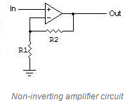

The basic place to start is a non-inverting amplifying circuit, used with any op-amp it effectively calculates the gain based on two resistor values going into an inverting and non-inverting input. (Gain= 1+ (R2/R1)

The OP-AMP IC we’ve been using is the MCP 6002, the datasheet can be found here. (http://ww1.microchip.com/downloads/en/DeviceDoc/21733j.pdf)

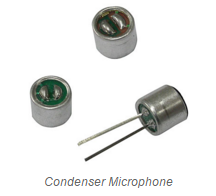

It’s an IC with two OP-AMPS and isn’t designed for anything too complicated, for the time being it’s perfect to get a basic amplifying circuit built.

Looking at the microphone itself, it’s a very basic condenser microphone that a lot of products (Mostly cheap ones) use in manufacturing. For the time being it’s ideal, however later on we might consider modifying the microphone as this can have great benefits without changing much of the circuit let alone power requirements (Direction, pop filters, windscreens etc).

Most microphones that feed into a amplifying circuit are biased by a resistor value and then thrown down to ground (0v), one could use a potential to guarantee the voltage level applied to a microphone also.

So far, we’re looking at a circuit like this.

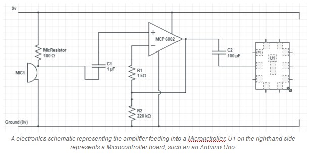
Other solutions that can be found on the web include using a different IC (As opposed to the MCP 6002) and modifying the circuit above. 

List of other IC’s and amplifiers we looked into.

<table>
	<tr>
		<td>IC Chip</td>
		<td>Link</td>
	</tr>
	<tr>
		<td>NE5535, TL071, OPA 371</td>
		<td>http://www.zen22142.zen.co.uk/Circuits/Audio/lf071_mic.htm</td>
	</tr>
	<tr>
		<td>LM386</td>
		<td>http://www.learningaboutelectronics.com/Articles/Microphone-amplifier-circuit.php</td>
	</tr>
	<tr>
		<td>MCP 6002</td>
		<td>http://www.aiscube.com/main/downloads/RVHS/RV_lesson_301112.pdf</td>
	</tr>
</table>

Although some may seem more suitable than others, as of right now we’ve focused on having a working circuit. In the long term, once we are happy with this solution we will most likely have a pre-built circuit instead of designing the non-inverting amplifier ourselves and choosing which OP-AMP to use. 

**Processing the Data**

The next step was to process the data, there were many ways to handle this from Microcontrollers to all-in-one IOT boards. We researched the following methods of taking data from a microphone to then process.

<table>
	<tr>
		<td> Potential Idea </td>
		<td> Description </td>
		<td> Pros </td>
		<td> Cons </td>
	</tr>
	<tr>
		<td> IOT Microcontroller Boards </td>
		<td> A whole board designed to handle multiple functions, such as Wifi/3G/Bluetooth with sensors, a built in microcontroller and more.</td>
		<td> 
			<ul>
				<li>A lot of built in features to reduce complexity of building communications between chips.</li>
				<li>Widely available, often designed for IOT solutions.</li>
			</ul>
		</td>
		<td> 
			<ul>
				<li>Often a lot of unneeded accessories (such as temperature sensor)</li>
				<li>Increase the physical size of the device based on unneeded extras</li>
			</ul>
		</td>
	</tr>
	<tr>
		<td> Microcontrollers  </td>
		<td>Singular processors, adjustable clock speeds, do not have the functionality of some of the features present on a microcontroller.</td>
		<td> 
			<ul>
				<li>A lot more freedom in deciding how to run the device.</li>
				<li>Removes any unnecessary features.</li>
				<li>Allows to scale down size of the sensor considerably.</li>
			</ul>
		</td>
		<td> 
			<ul>
				<li>Longer to produce and build together as can take more components.</li>
				<li>More complicated, requires further electronics knowledge.</li>
			</ul>
		</td>
	</tr>
	<tr>
		<td> Barebones  </td>
		<td>Using only modules to handle the work, avoiding any form of major processing.</td>
		<td> 
			<ul>
				<li>Potentially reduce power usage.</li>
				<li>Removes any unnecessary features of a Microcontroller.</li>
				<li>Allows to scale down size of the sensor considerably.</li>
				<li>A lot more freedom in deciding how to run the device.</li>
			</ul>
		</td>
		<td> 
			<ul>
				<li>Longer to produce and build together as can take more components.</li>
				<li>Much more complicated, requires further electronics knowledge.</li>
				<li>Difficult to prototype a sensor without a Microcontroller.</li>
			</ul>
		</td>
	</tr>
</table>

For the purpose of a prototype we decided to work with a IOT Microcontroller, we need to investigate common IOT Microcontroller modules, ones that are ideal for our implementation of this IOT device. 

**Arduino Microcontroller Boards**

Arguably one of the most popular development boards commercially available, has a full function IDE written in C++. Multiple different boards designed for different purposes, all having sharing the basic functionality (such as analog inputs) while offering unique differences. They allow for shields to be placed into them which add even further adaptability, allowing for 3rd party hardware to be interfaced easily into the device. This functionality can be as simple as an SD card reader, a WiFi chip or even an external clock. 

Which one suited our best needs? What did we need in a device?
<ul>
	<li>Low power</li>
	<li>Within reasonable price range</li> 
	<li>Relatively small</li>
	<li>Ability to interface with certain components (Backup mediums if network is down, an external clock to keep track of time, an ADC input and form of digital output to transfer data to a wireless module).</li>
</ul>

This narrowed down our choices to the following Arduino devices.
<ul>
	<li>Arduino Nano</li>
	<li>Arduino Pro Mini</li>
	<li>Arduino Macro</li>
	<li>Arduino Uno</li>
</ul>

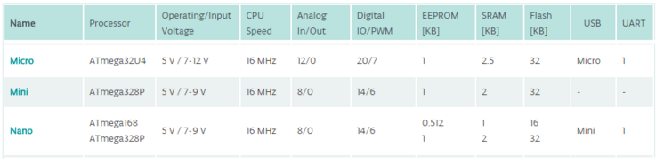

**Arduino Nano**

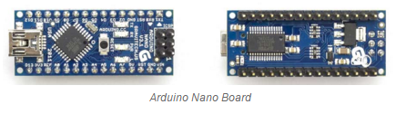

(https://www.arduino.cc/en/uploads/Main/ArduinoNanoManual23.pdf)

“The ATmega168 has 16 KB of flash memory for storing code (of which 2 KB is used for the bootloader); the ATmega328has 32 KB, (also with 2 KB used for the bootloader). The ATmega168 has 1 KB of SRAM and 512 bytes of EEPROM (which can be read and written with the EEPROM library); the ATmega328 has 2 KB of SRAM and 1 KB of EEPROM” (Arduino.cc, n.d.)
<ul>
	<li>Serial: 0 (RX) and 1 (TX). Used to receive (RX) and transmit (TX) TTL serial data. These pins are connected to the corresponding pins of the FTDI USB-to-TTL Serial chip.</li>
	<li>External Interrupts: 2 and 3. These pins can be configured to trigger an interrupt on a low value, a rising or falling edge, or a change in value. See the attachInterrupt() function for details.</li>
	<li>PWM: 3, 5, 6, 9, 10, and 11. Provide 8-bit PWM output with the analogWrite() function.</li>
	<li>SPI: 10 (SS), 11 (MOSI), 12 (MISO), 13 (SCK). These pins support SPI communication, which, although provided by the underlying hardware, is not currently included in the Arduino language.</li>
	<li>LED: 13. There is a built-in LED connected to digital pin 13. When the pin is HIGH value, the LED is on, when the pin is LOW, it's off.</li>
</ul>

The nano is a small device that has all the functionality that we ideally would want, it has connections over Serial, I2C and SPI (Although supported by hardware, not supported by Arduino libraries).

It requires a minimum of 5v operating power, anything below and functionality is lost and we run the risk of disabling features.

It can run the ATMega 168 or 328, we would ideally use the 328 as it offers much more space (EEPROM, SRAM and Flash memory) and is a later iteration over the 168. The dimensions of the device are 0.73” x 1.70”.

**Arduino Pro Mini**

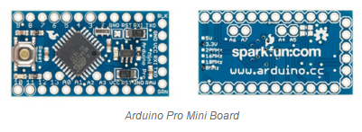

(http://www.atmel.com/images/Atmel-8271-8-bit-AVR-Microcontroller-ATmega48A-48PA-88A-88PA-168A-168PA-328-328P_datasheet_Complete.pdf)

Essentially the Pro Mini is identical to the Arduino Nano except for the added ability of lower bootloader space and the ability to run at 3.3v over 5v and other small differences that do not add much to our required project.

“There are two version of the Pro Mini. One runs at 3.3V and 8 MHz, the other at 5V and 16 MHz... The ATmega328 has 32 kB of flash memory for storing code (of which 0.5kB is used for the bootloader). It has 2 kB of SRAM and 1kBs of EEPROM.“ (Arduino.cc, n.d.)

**Arduino Uno**

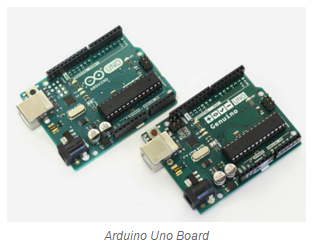

The Uno sticks out in this comparison due to its size difference against the previous 3, which begs the question - why then? Simply put, the Arduino Uno is a very friendly board to use, and for prototyping would be ideal as we would not need to worry about many problems that we could face when going straight in with one of the other solutions. It also shares a lot of common ground with the other 3, except for its size.

It runs the ATmega328P, which has slight differences to the ATmega328 (Slight power reduction). Only uses 0.5KB of the Flash memory for the bootloader, runs at 16MHz and needs at least 6v operating voltage which like the macro can cause instability if run at this low a voltage. 

The biggest benefit for us, was that the Uno would offer easy adaptability and help quickly work with a prototype while we decide which microcontrollers to use, their frequency, and work on breadboards instead of soldering straight away. 

**MBED FRDM-K64F**

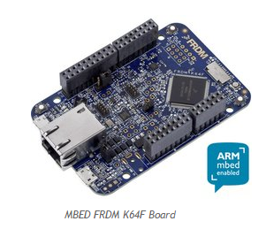

Another popular developer of IOT boards, using ARM based architecture instead of AVRs. The argument between these two processor architecture is often put down to ARM is powerful, and AVR is not so much. There are variants on the processors but otherwise they tend to stick to those groups. MBEDs have an online compiler and IDE, which works in a similar fashion to Arduinos but is effectively always online which comes with its own problems such as requiring internet access. 

The most ideal MBED board we found was the FRDM-K64F which is regarded as the flagship board, it’s perfectly ideal for prototyping - but in the long run most likely would be too much of a power killer. It’s compatible with most Arduino shields too. In the long run however, the FRDM-K64F while having many features, especially when combined with the MBED application shield - is too much functionality for what we need bundled down, even in a prototype we do not need such complexity. 

Even with all its functionality switched off the device consumes more amps than one of the arduino boards. However we decided that this board would be ideal if used for our hub, as during that period power will not be a concern. 

####Iteration 2 - Making our own amplifier
#####Issues with previous iteration
No issues to report, this is the first design iteration.

#####Result of iteration
Using our amplifier we’ve been able to start sampling sound. We’ve been experimenting with the FRDM K64F and Arduino Uno in measuring sound. Our experiments with these boards consisted of testing the circuit we had made for measuring sound levels. Using the FRDM-K64F:

~~~c++
Serial serial(USBTX, USBRX); // Serial connection
 
// Initialize a pins to perform analog input
AnalogIn   ain(A0);
 
int main(void)
{
    while (1) {
        // print to serial analog input
        printf("normalized: %d \r\n", ain.read_u16()); 
        
    } 

}
~~~

The FRDM-K64F has given us superb accuracy when sampling the microphone, values ranging from 0-65555. This is due to the 16bit analog to digital converter on the board. 

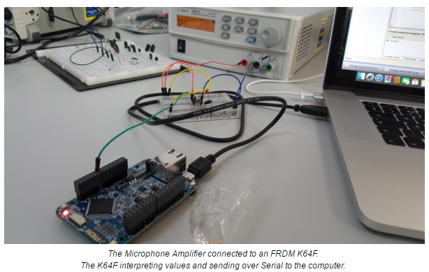

We also sampled using an Arduino Uno:

~~~c++
int analogPin = 3;     // Microphone amp connected pin 3
int val = 0;           // variable to store the value read

void setup()
{
  Serial.begin(9600);          //  setup serial
}

void loop()
{
  val = analogRead(analogPin);    // read the input pin
  Serial.println(val);             // print to serial the value
}
~~~ 

We need a way to take these values and use them to sample the sound wave. The values are being sent over serial, so having a program listening on serial and processing data will let us be able to visualise sound over time. 

 Using Java we have written a program that talks on serial to the boards. Our program samples 50 times in a second, long enough to gauge a sound wave. Using the minimum and maximum samples we calculate the range and pass all these values along to a file to be saved.
 
This is the section of our code which samples at 50 times a second:

```java 
	// Read values from sensor

        /* Calculate the range of 50 samples */
        int i = 50;
        int max = data[0];
        int min = max;
        int range;
        int j;

        while (i-- > 1) {
            j = data[i];
            if (j > max) {
                max = j;
            }
            if (j < min) {
                min = j;
            }
        }
        
        range = max - min;
        
        // Save to file 
        // ...
```

Logging this data shows the structure and accuracy behind our sensor. Using this data we can increase the sensitivity of our sensor or increase the sample rate to gain a better understanding. 

As of right now the values (0-500) on the Y axis are not too useful for us, we can determine whether noise has risen but we ideally want to work with decibel levels. 

To view our testing results in more detail, please see here. 

####Iteration 3 - Using a pre-built amplifier
#####Issues with previous iteration
The size of the amplifier we built was ideally too large for a small sensor, we could condense it by soldering and moving components closer together but it would be easier and more efficient to buy pre-built amplifiers. 

#####Result of iteration
We’ve purchased a pre-built amplifier to simplify our circuit, ideally we don’t want wires going everywhere and using a prebuilt amplifier makes our task easier due to less complexity and time required to build one. 

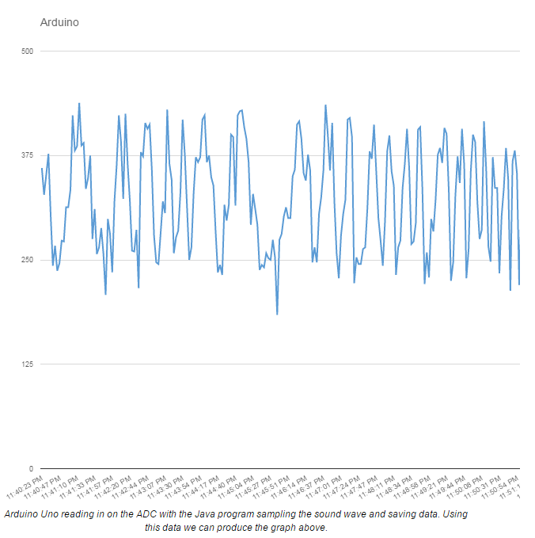

The next step is to wire the pre-built microphone amplifier to one of the boards, we’ve decided to use the FRDM K64F for the time being as its sample range from 0-65555 makes it appealing to work with.
 
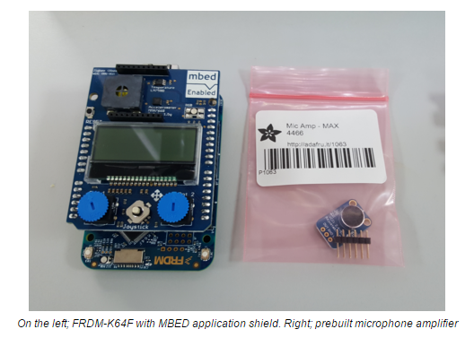

This was a very simple change and nothing too complicated occurred, but it does benefit us in the long run. The size of the new amplifier works in our favour as its size makes it very easy to adopt into a system where as previously we had a cluster of wires and components. It doesn’t risk being disconnected when compared to our previous amplifier which was held together through loose wires. 

* For a version of this code see <a href="/sensor/initialNoiseLevel/sketch_dec02a/sketch_dec02a.ino">here</a>.
* For the Java sampling program see <a href="/SensorJavaSamplingCode/">here</a>. 

####Christmas Deployment
Over the christmas period we deployed a version of our sensor that wrote data to an SD card. This was designed to go into one of the resident's houses and record data for a short period of time. We used an arduino uno with a shield that contained an SD card reader. 

We needed a way to power the whole board for the time that we would be away over the christmas break. A standard Uno with no low power code drew a current ~42.5mA. A standard AA battery would provide around 1500mAh.

 $$ 1500mAh/42.5mA=35.29 hours $$

The christmas break lasts 4 weeks so 35.29 hours was going to be nowhere near enough and we would only get data for the first day and a half. 

We discussed several other options that included rechargeable batteries, multiple AA batteries and plugging it into the wall. Multiple AA batteries was discounted because it would be very expensive and we’d need a lot of them. It would also increase the size drastically.

Rechargeable batteries looked like a viable option as they came in much higher capacities and would allow the client to recharge them if they did happen to run out when we were away. We did some initial calculations with the 10000mAh battery that we had to hand:

$$ 10000mAh/42.5mA=232.94 hours $$

$$ 232.94/24= 9.7 days $$

While this was getting better it was still slightly too short for what we needed it for. At this point bigger batteries became more expensive and the University wouldn’t be able to order them in time. This meant we had to make the arduino use less power when it was running. To do this we used low power libraries and turned off everything that we weren’t using. After doing this we managed to get the power usage down to ~22mA. 

$$ 10000mAh22mA= 454.54 hours  $$

$$ 454.54/24= 18.9 days $$

This was a more reasonable amount of time and would give us a good amount of data that we could use in the future. The battery pack we were using could also be easily charged using  a micro usb cable (the same kind that is used to charge phones) which meant we could ask the client to charge it if it did run out of power.

A version of this code can be found [here](sensor/SDCardPrototype/)

We collected a significant amount of data from this and a graph of the levels we recorded is included below. You can also find the raw data [here](sensor/cdata.csv)

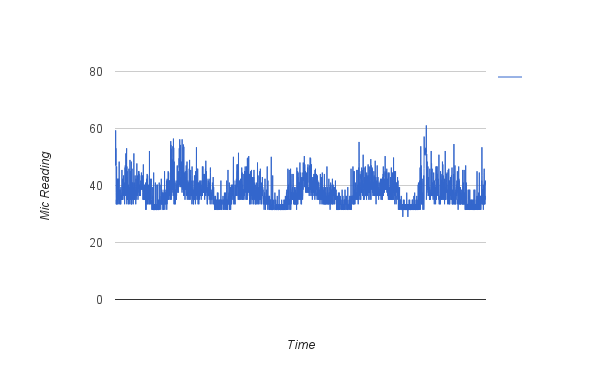


####Iteration 4 
#####Issues with previous iteration
There were several issues that arose with the code and hardware we created during the christmas testing We discovered that the mic signal was not being amplified enough which led to a lot of readings being the same even though the noise levels were vastly different. The previous iteration also recorded data directly to an SD card for us to look at later. This is an issue as we needed some way of transmitting data back to the board.

#####Result of iteration
We struggled with amplifying the sound as there we were also amplifiying a lot of electrical noise. We pushed this back to a future iteration as we were getting held up by it.

We added an Xbee to the board so that we could transmit data back to the hub which worked without any issues.

####Iteration 5
#####Issues with previous iteration
We noticed some issues with the previous iteration cutting off data after sending large amounts. This is an issue that needs fixing. We are also currently getting the time for timestamping the data from the internal clock. This is proving to be an issue as the time is not accurate. Over longer periods the time on the board will drift further and further away from the actual time. Also, if the sensor runs out of battery the time will be lost.

#####Result of iteration
The loss of data when transmitting was due to the Xbee buffers being overloaded as we sent the data too quickly. To solve this we added small delays in between sending the data. This fixed the issue and the data appears to be being sent without any issues. We also added a clock to the circuit. This has a backup battery so it can still keep time in the event of the sensor losing power. This clock is also accurate and can keep to +/-1 second over a year. 

####Iteration 6
The aim of this iteration was to fix the issue in iteration 2 where we discovered that mic readings were not being amplified enough to pick up changes in the noise level.

#####Issues with previous iteration
No issues

#####Result of iteration
We added a 16-bit adc which gives us a higher resolution and also allows us to remove electical noise using a comparison of two pins. To do this we used a potential divider to half the 3.3v signal that the board was running off and put in pin 1 of the ADC, we then put the mic output into pin 2. Comparing these 2 pins gave us a wave that was much less noisy, as the power voltages were effectively cancelling each other out. This also means that we could produce a wave which had an maximum amplitude of that was the same as our resolution whereas previously there was a noise baseline which, when amplified, also increased leading to us not being able to amplify it too much. These changes allow us to see the noise level change in much more detail and also pick up smaller changes.

####Iteration 7
For this iteration we wanted to add a rechargable battery to the circuit so the client could charge it in their house without having to buy standard alkaline batteries. We also wanted to think about low power.

#####Issues with previous iteration
None

#####Result of iteration
We changed our board from an arduino to a more low power version. This board is called the 'Rocket Scream Mini Ultra 8 MHz Plus' and draws a much lower current than the arduino due to it's more power efficient on board regulator. This board also comes with a battery connector which allows us to plug a lithium polymer battery into it and provides pins which a source of up to 20V can be plugged in. We began testing charging it using a standard usb charger and it seems to work, albeit slowly as the charging circuit can charge the batter using a max current of 500mA compared to the 2A you'd be able to charge a similar sized phone battery at. We also tried a different version of the board which used even less power, the 'Rocket Scream Mini Ultra', however we decided against using this due to lack of features such as as voltage regulator, which we would need to use our battery efficiently, and recharging circuits.

####Iteration 8
In this iteration we wanted to make sensor run at a lower power so it could last on batteries for much longer.

#####Issues with previous iteration
Test code was running on the board constantly which led to the battery not being able to fully chage as the code was making the board use a lot of power. This led us to think there was an issue with the charging circuit and look into that. The issue in the end was fixed by making sure the code didn't run and leaving it to charge for a longer period of time.

##### Result of iteration
We used the [Rocket Scream Low-Power](https://github.com/rocketscream/Low-Power) library which allowed us to turn off all of the functions of the processor we were not using and put it into a deep sleep mode. This deep sleep dramatically reduced power usage. We are using the watchdog timer on the board to allow us to set the amount of time we sleep however the watchdog timer can only count up to 8 seconds so to get it to sleep for 1 minute, we needed to run the it 8 times. Some example code for this can be seen below:

```c++
#include <lowpower.h>
#include <avr/wdt.h>

bool count = 8;

void setup()
{
	//Clear the prescaler
	WDTCSR |= (1<<WDCE) | (1<<WDE);

	//1001 for the watchdog prescaler is 1024k cycles 
	//which is ~8seconds
	WDTCSR = 1<<WDP0 | 1<<WDP3;
	
	//Enable interrupt
	WDTCSR |= _BV(WDIE);

}


//Watchdog timer interrupt
ISR(WDT_vect)
{
  if(count > 0)
  {
  	//decrement the count 
  	count--;
  }
  else
  {
  	//Do nothing which returns to the main loop
  }
}

//Put the processort to sleep until it's woken up bt WDT
void sleep()
{
	LowPower.powerDown(SLEEP_FOREVER,ADC_OFF, BOD_OFF);  
}
void loop() 
{
    // read the data...
}  
```
####Iteration 9
##### Issues with the previous iteration
There were several issues we noticed after the iteration. One of these was that the watchdog timer wasn't accurate enough and readings times were drifting a lot. We also found that the code sometimes failed and just stopped working completely. The Xbee was also still drawing a large amount of power as it was running in transmit mode all of the time, even when it was not being used by the program.

#####Results of iteration
We changed the clock to a DS3231 which allowed us to fire interrupts at predetermined intervals, such as every minute. We could then use that wake the processor from it's sleep and it could then take the readings. We made some modifications to the DS3231 by removing the power and transmit LEDs to reduce power consumption. The clock ensured that readings were taken at the same point every minute. We also reprogrammed the Xbee to use pin hibernate mode. This meant that when we pulled a pin low on the board, the Xbee would also enter sleep mode. This sleep mode reduced it's power usage down to around 500μA which was acceptable. The Xbee was then only powered on when we wanted to send data, which was a tiny fraction of the time. Changing to interrupt based processor sleep seems to have solved the problem of the board not waking from sleep.

All code mentioned in this section can be found [here](sensor/)


### Bibliography

Arduino.cc, (n.d.). Arduino - ArduinoBoardProMini. [online] Available at: https://www.arduino.cc/en/Main/ArduinoBoardProMini [Accessed 16 Jan. 2016].
