
##Hub

[Back to contents.](#contents)

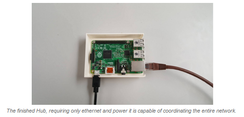

The Hub is the coordinator of the network. Its the middleman to all incoming and outgoing traffic from the sensor or clock to the webserver. It will backup data if the network fails at any point, to determine network failure it utilises the libraries provided by the Networking solutions (see [Networking.](#networking)). Using these libraries the hub can maintain a robust network and offer these services:
* Node Discovery, can determine when nodes disappear or appear and assign them 'nicknames' that can be associated to that node. (e.g "sensor on the balcony")
* Fragmentation and Assembly of large payloads, large payloads can be fragmented and reassembled when transmitted across the network.
* Heartbeats, keeping up to date with each node and knowing their current status. Fits into node discovery.
* Transmission reports, for each packet sent a status packet is returned. With this the hub can identify whether a transmission was successfully or not.
* If the network fails the hub will backup any data is has locally and any data it is currently trying to transmit until the network connection has been re-established.
* Will forward all sensor data to the webserver for further processing, if possible otherwise saves locally.
* Forwards requests from the clock for most recent 24 hours of sound averages and will transmit back the response. If an error occurs will transmit an appropriate error code.

The hub is comprised of multiple parts: [Board](#hub_board), [Communication / XBee](#hub_xbee), [Case](#hub_case)

**Board**
The Hub uses a Raspberry Pi Model B+ running Raspbian Jessie Lite, the Pi offers GPIO pins to connect external boards to it. Using these pins, an XBee module is connected on serial and provides the Pi with its position on the network as coordinator. The Pi only requires three connections for it to function, an ethernet connection, the serial connection to the XBee and finally power. The programs controlling the network are written in Python 3.

**Communication / XBee**
The XBee module is configured as coordinator on the network, giving the Hub its status and control on the network. The XBee can address any other XBee module on the network or broadcast to all of them. All other XBees address the coordinator as it is the centre point of the network. Sensors forward their data through the XBees to the Hub the Clock makes requests to the Hub also.

**Processing Role**
It handles data coming in from the sensor and requests from the clock. The clock can request decibel averages of the past 24 hours using the Hub as a middleman, the Hub then forwards this request to the web server and returns the result to the clock. The sensors submit their sampled data to the hub in order for this to then be sent forward to the web server. 
The Hub takes into account that it may not be able to reach the web server for various reasons, and will try multiple times to connect. If it fails while transmitting sensor data it will save this on the SD card in the Pi, if it cannot request data for the clock it will return an error code instead. 

Upon a series of failed attempts, once a successful attempt is made the Hub will transmit all previous stored data and delete it afterwards to clear space in memory. 

**Case**
The case was a 3D printed design that was required due to the extra components that the Hub required. The Pi has many off the shelf cases that can be used, however due to our requirement of fitting an XBee module these cases would not suffice. The 3D printed case was capable of fitting the XBee module as well as the Pi. The case needed to house the Pi for general concerns of deprecation over time, we didn't want the client to accidently knock a Pi off the shelf without some protection.

###Initial Premise
Unlike the sensor, power consumption was not an issue as the client told us that we could connect to a power outlet. It didn't need to be outside the clients premisses either. This meant we could use any feasible board for this role. We needed a board that could offer the most useful functionality towards our project.

The hub was required to be a middleman between sensors and the web server, forwarding traffic onto the website over ethernet and handling any heavy processing. Initially we planned on using an FRDM-K64F board due to familiarity and easy access to them within the University. 

###Hub Hardware
####Iteration 1 - Researching Hub Solutions
#####FRDM K64F

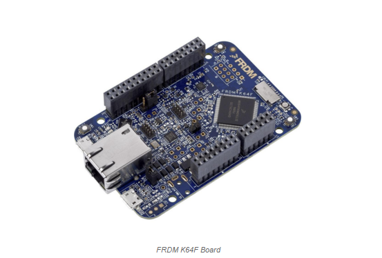

The FRDM-K64F board has a lot of unneeded functionality. It has an unnecessary amount of sensors on the board itself (temperature sensor and accelerometer for example) which wouldn't add to our project benefits. Although as previously stated we are testing this board because of its availability and our familiarity with it. We are familiar with this board and we know that it has a shield that has the ability to interface with an XBee which is what we decided to use for our networking. (insert link to networking decisions) Using the board would not be an issue, as we have had extensive skill in handling and programming it. Including the MBED Application shield would benefit us in providing pins designed for an XBee module to interface with. It also offers an LCD display for reporting information back to the client, which could be useful for showing basic messages. However the shield does offer a lot of useless additions as well. Introducing more sensors and obstructing every pin on the FRDM makes it unlikely to be a realistic option for our Hub.

Here I was going to include my case design implementation for the hub, but it went on for a while, would you like me to do that in its own page?

###Research Into other Boards

####Arduino Uno

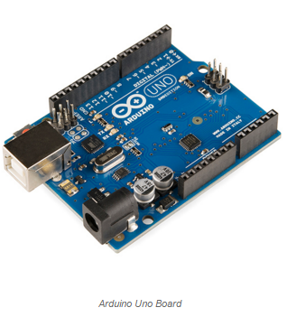

Considering the Arduino Uno for the hub as a likely candidate for the fact that the board itself does not have any sensors that would be considered unnecessary like on the FRDM K64F. It is programmable in C much like the K64F so will essentially use the same code. The main reason for choosing this board would be to trim the unessential things from our current solution. The Uno is also a well known board that is vastly documented. 

Unlike the K64F the Uno lacks an ethernet port built in. To remedy this we would have to add an Arduino shield capable of offering ethernet such as the Arduino Ethernet shield. The shield while similar to the MBED Application shield provides the ability to transmit more than just data along ethernet, it could provide power too, although this means adding the PoE (Power over Ethernet) component. This added functionality means the possibility for less wires, this means easier instillation for the client as only one connection would be required. There are libraries that exist to help use the shield and it’s functionality and the board offers a lot of useful debug information regarding current status with sending data, making it easier to work with.

With the problem of ethernet solved this only leaves connection to XBee out. In order to fix this we would have to either, include another [shield](http://uk.rs-online.com/web/p/products/6961670/?grossPrice=Y&cm_mmc=UK-PLA-_-google-_-PLA_UK_EN_Semiconductors-_-Semiconductor_Development_Kits&mkwid=s8484M9Xf_dc|pcrid|88057061283|pkw||pmt||prd|6961670&gclid=Cj0KEQjwid63BRCswIGqyOubtrUBEiQAvTol0WdagHobLZ9zO5iXOsR0-jdPUrM43OJ-dTZv86HIMcgaAkHy8P8HAQ) that had a breakout for the XBee or physically wiring up an XBee. Wiring up an XBee would require soldering the required pins on the XBee to wires that we could plug into the headers of the ethernet shield. If we choose to have the ethernet shield with the PoE module the XBee shield would probably not fit and therefore we would have to solder the XBee to the board. In circumstance of soldering the XBee it would also lead to being unable to then modify the firmware settingson the module without desoldering first leading to more spendature of time. Otherwise we could use the shield on its own, meaning we could reconfigure the XBee at any time.

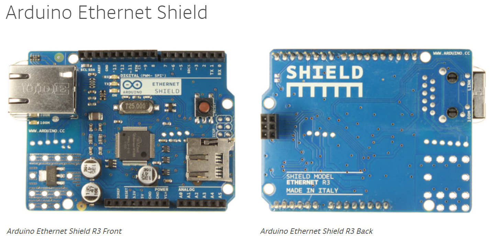

####Arduino Yun

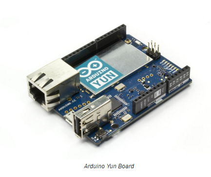

The Arduino Yun is a very unique Arduino board, as it offers two processors. The AR9331 handles a Linux distribution while the ATMega32U4 handles the board. This means we can run an Operating System with all the benefits that brings on this board. The board comes with an ethernet port and WiFi as well, making it immediately more ideal than the previous two boards mentioned. The board also comes with an SD card port for supplying the Operating System, so in theory a large SD card would allow data logging and more storage in general. The board itself can run Arduino sketches which can interface with shell scripts running on the Linux distro, although the two processors are kept separate; bridging is possible due to a library provided.

However the Yun lacks a great deal of hardware support in terms of volatile memory only offering  64MB of DDR2 ram with 16MB of flash, 9 of which is taken by the Linux distribution. With this considered a better alternative would be something like a Raspberry Pi which could offer more memory and more Operating Systems varieties. The price of a Yun is higher than previous entries, averaging around £50 which is more than double the price of an Uno. 

####Micro Server

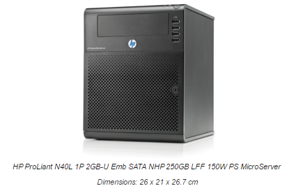

It is plausible to use a Micro Server in place of the Hub. The server could have a serial programmer connected to a XBee and use programs to read and access the data coming in. Using a Micro server would give huge benefits in terms of processing power, data storage and security. We could have our own choice of operating system and hardware. Data could come in and be backed up internally, then processed to be sent off. However price and size could cause issues, as these servers do not often come cheap and are a lot larger than other potential solutions. They can also become quite loud and considering noise is what we are trying to help our client with it is probably not an ideal solution furthermore it would draw a lot more power than a development board meaning it could have a visible cost impact on the client.

####Raspberry Pi

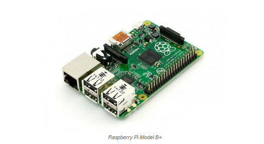

The Raspberry Pi is a well known mini computer in its own right and full of IoT uses too. Following on from the Microserver idea, the premise of having an operating system was very appealing. Especially the idea of being able to remotely access the Hub, in which both the Microserver, Yun and Pi could provide this. The Pi while being smaller and considerably cheaper than its Microserver counterpart did lack internal hardware to boot, but for the purpose we had planned it was more than adequate. It would’t be noisy either. 

The Pi was a good middleground between the Yun and the Microserver. It didn’t have as many Operating Systems to chose from compared to the Microserver (due to its Arm architecture) but it did offer a good selection of Operating Systems in terms of networking and much more compared to the Arudino Yun. Its price was not as expensive as the Yun or the Microserver, averaging around £25. 

Internal storage could be managed using a SD card of any size meaning data logging was possible as well. With this being built in as well as an ethernet port it has many advantages over previous entries. The only piece of hardware that is lacking for what we need is an XBee connection. Although solutions are the same as the Arduino Uno, either we use a shield with XBee breakouts or we physically wire an XBee up.

However with all this, the Pi did lack the speed of other boards that didn’t require a OS to maintain. It also didn't offer built in WiFi unlike the Yun, but we were unlikely to use this anyway due to potentially changing security of a WiFi network. 

####Research Conclusion

We decided to use a Raspberry Pi (Model B+ 512MB) over other solutions. While the Arduino and FRDM K64F boards offered speed, they lacked remote accessing and long term storage and would require more adaptions to work around this. The Microserver was too large, expensive and potentially noisy. The Yun while very promising lacked internal hardware to match the Pi as well being double the price. The Pi offered a full operating system while maintaining a small size, better secure networking and remote access for updating on the network. This meant that if a bug was found in our code we could remotely update in on the hub, we would also be able to access any logged debug information from the program. 

#####Raspberry Pi (Model B+)
We decided to use a Raspberry Pi (Model B+ 512MB). The Pi offered a full operating system, better secure networking and remote access for updating on the network. This means that if a bug is found in our code while the hub is deployed in our clients house we could remotely update in on said hub. In the same way we would also be able to access any logged debug information from the program.

#####Moving forward with the Pi
The Model B+ will be supplied by the university. The operating system of choice was Raspbian Jessie Lite because it is the officially supported OS of the Pi therefore, recommended by the developers of the Pi. The Pi will have to be connected to the XBee over serial, however in order to use these ports they have to be masked by systemd to force them to be free on startup. 

Then we need to write a program capable of handling incoming AT packets from serial, interpret them and respond accordingly.

The program will be written in Python 3 as its easily available on the Pi and offers all the functionality required to create a robust networking program. We will have to modify /etc/rc.local to contain “sudo python hub.py” so that the script will start every time the Operating System starts. If the network was down, or errors occurred on transmit then the Pi will save data locally, and retry on its next attempt.

###Language of Choice: Python is this description of code or why python was chosen?

*Why Python*

We have chosen Python because it was easily available on the Pi, had plenty of documentation supporting it and is a very easy language to read from another developer's standing. In terms of interfacing it with serial and the network there are plenty of libraries that exist to make this as simple and efficient as possible, we have decided to use PySerial and Requests to handle these requirements. 

*Python Libraries*

PySerial and Requests simplified any complications we may have had from writing our own initial libraries as well as having organised documentation to support them. They abstracted a lot of complicated hardware tasks (such as interrupt handling on GPIO pins) and communicating over the network. Other libraries we plan on using are those standard to Python, time for handling timing operations, random for random calculations, threading to handle multiple tasks to name a few.

###Coordinator on Network
The Hubs most important role will be that of the coordinator on the network, it is the centre point. Due to how XBees address each other, it is very easy to send data straight to coordinator using its predefined 64bit address (0x0000000000000000).  The Hub could address any node on the network and with this could determine which nodes were which and if they were still within range.

###Result of Iteration
We've successfully found the hardware to use for our Hub, the language to program in and how we plan to interface with our network. The next step is to implement AT mode, a simple system for handling messages on a network. Using the Raspberry Pi as our Hub will offer us an operating system with the added benefits that brings such as security or remote access. The Pi can easily interface with the external components we need and allow us to remotely access our low powered network if need be using SSH from outside the clients home.

####Iteration 2 - Pi with AT Mode

#####Setting up the Pi
Now that we’ve settled on an operating system, hardware and programming language we can progress to implementing a working network with the Pi. By default the Pi uses the serial ports for terminal access, for us this is of no use and we need those ports for the XBee to communicate on. In order to open the ports we had to go through Systemd which is the main configuration tool for handling debian related Linux distros. Systemd is quite new to Raspbian and because of this most tutorials offering assistance are outdated as they refer to older versions of Raspbian where the use inittab was involved. 

In order to change anything we need access to the Pi. We’ve been remotely accessing the Pi using SSH and a program called Putty, this gives us full access to the Pi without having to actually plug anything into it. Researching Systemd has shown us that you can mask services which effectively disables them entirely from starting. First we needed to find the service we were looking for.

~~~
systemctl list-units
~~~

This returned us a long list, so from this we needed to find which service was the serial port. As it transpires the Pi will always use the same serial port as it only has one - ttyAMA0. We knew what the serial port is, so we now needed to mask it.

First we decided to play safe and stop the service.

~~~
systemctl stop sys-devices-platform-soc-20201000.uart-tty-ttyAMA0.device
~~~

Then, we masked it - to stop it from starting again on a reboot.

~~~
systemctl mask sys-devices-platform-soc-20201000.uart-tty-ttyAMA0.device
~~~

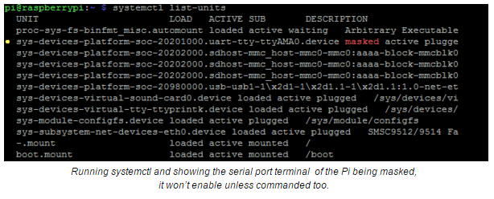

Now that serial is free we’ve got to connect the XBee to the Pi, looking at the pinout sheet for the Pi we can see which pins to interface with when compared back to our XBee. 

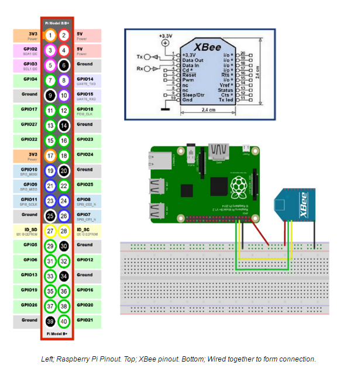

The final step is to make sure we have the libraries we need for python, using a program called pip we can install these libraries. First of all pip had to be installed, which could be done using.

~~~
python -m pip install -U pip
~~~

With Pip installed, we needed to then install the libraries required for our Pi.

~~~
pip install pyserial
pip install requests
~~~

Now our Pi is ready to act as a coordinator. The next stage is programming it and making sure it knows how to act in response to our data. We need to consider the possibility of no access to the internet too, we have to ensure that data isn't lost at any point. 

#####What does the Hub need to do?
The Hub is the middleman between the webserver and the nodes on the network, it has a responsibility to ensure data from those nodes reaches their destination. We need to be able guarantee data will be logged if it cannot reach its location, or if a request can’t be completed such in the case of the clock. The Hub should wait and listen for any incoming data and once a full set of data has been received act upon it, if it’s a request from the clock - request values from the server and respond back. If it’s data from one of the sensors then that needs to be sent to the webserver. It needs to be able to distinguish between a sensor and a clock otherwise it’ll send data to the wrong nodes or request values from the webserver for the wrong reasons. 

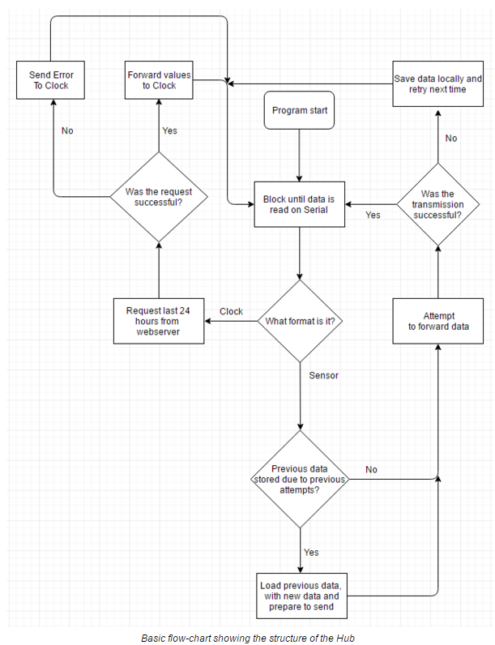

######Basic Structure
The Pi will run a thread that continuously waits on serial input, once received it will take as much as it can in before analysing what it’s received. Upon analysing it will decide whether the data is a request from the clock or sensor data, if sensor data it will attempt to transmit it to the webserver, if a request it will request the last 24 hours of average sound values from the web server. If a clock request is made and the web server does respond then the hub expects a format of 24 integer values in an array, when these values are obtained it forwards them to the clock. 

######Data backup
In case the connection between the hub and webserver fails, we need to ensure data backups. In the case that the network fails the Pi will write all of its currently available sensor data to a local file, it’ll re attempt to transmit data the next time it receives another set of sensor data. If that fails, then the cycle continues - save data and try again next time. The hub does try a total of 5 times before giving up and saving to a file, just in case there was a particular error that occurred.

######Distinguishing traffic
The hub needs to be able to tell which node is transmitting which data to it, how does it know whether the data it's received is that of a clock making a request or a sensor sending data? The clock sends data in a format of “R:!”. This is unique, it never appears in any of the sensor data and so when the hub receives any data it will scan for this particular set of characters. If received, it will know that this is a request and not sensor data. Otherwise it will assume all incoming data is from the sensor and forward it to the webserver. 

###Result of Iteration
Although we now have a functioning Hub that can transmit and receive between a clock and sensor, it can't handle data coming in from multiple sensors. It also can't fragment large payloads which is quite a concern but we have managed to bypass this by using the internal timers of the XBee hardware to our advantage. However that doesn't make that a good solution and a long term fix will be a priority in the next iteration.

Overall the system can function, but if any major strain occurs then the system will suffer. The Hub can handle if the network goes down and will backup data when needed. It can request values for the clock and transmit sensor data but only from one sensor on the network, anymore and data will become malformed.

Our next iteration will focus on fixing packet fragmentation, handling multiple sensors and hopefully error recovery.

####Iteration 3 - Pi with API Mode 
Now that we’ve changed from AT mode to API mode (see [Networking Iteration 4](#network_i4)), not much needs to change but at the same time the properties of the Hub have greatly expanded. The API has been designed so that more functionality could be provided without requiring an excess amount of modification to existing code. 

The basic idea being, we only need to change one line:

~~~python
serial.write(“Hello world!”);
# becomes …
response = xbee.sendMessage("sensor1", "Hello world!")
~~~

Now although we’ve added an extra parameter, that is purely beneficial. The extra parameter allows us to address individual nodes on the network, if we want to address every node we specify ‘broadcast’ as the node on the network.

~~~python
# Will message every node on the network with “Hello world!”
response = xbee.sendMessage(“broadcast”, “Hello world!”)
~~~

The nicknames for nodes helps in multiple ways, not only does it allow us to forward this data to be used in identifying different sensors, clocks etc but we can use it to show the client a name that is more legible than a series of hexadecimal values. 

#####Hub Python Library

For information regarding the process behind designing and researching the API required for the Hub, please see [Networking, Iteration 4.](#networking_i4).

The Hub is utilising a library written to handle the API mode of the XBee, the library has many purposes that help make the network as robust as possible. Using these features we’ve been able to make our coordinator incredibly robust as handling large payloads, transmission errors, node discovery and error recovery.

Below is a flowchart diagram demonstrating the new processing behind the Hub.

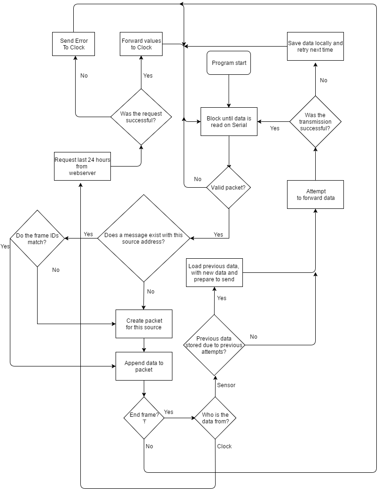

######Node Discovery and Heartbeats

Being able to determine what sensors already exist on a network offers us much more functionality. We’re are able to ping nodes on the network and determine their network status.

On startup the program running on the hub will  load from memory any nodes it has previously found, after this it’ll try to find any new nodes on the network and save them. This way, it can determine if a node was missing (Maybe a sensor was moved) and could report this back to the client. The hub will periodically send heartbeats across the network to see any changes on the nodes. If a change is detected (such as a node disappearing) it will report this back to the server, this way we can display this information on the website that a sensor was out of range or had run out for battery. 

The Hub utilises the ability to periodically send heartbeats to nodes on the network, this ensures that nodes are up to date - it also falls under node discovery as it will use heartbeats to add new nodes to the network. Once the Hub detects a node its unfamiliar with, it will request its ‘nickname’ for assigning it in its map. The format being:

~~~python
# Send node a HB request asking for it's nickname
response = self.sendMessage(node, "HB#:")
#  Wait for node to respond
time.sleep(.25) 
 # Failed to contact the node
if not response == 0:
	return
#  Add the node to the map along with its 64bit address
# …
self.destinationNodes[name] = newNode
~~~

If the Hub fails to contact a new node, it will reattempt the next time the node retransmits to it. 

With node discovery it simplifies sending messages from the coordinator to the sensors, instead of requiring individuals addresses, you can pass names of nodes into the “sendMessage” function and it will conclude the address based on this from a map structure storing a key to a value. The key being the nickname pointing to the 64bit address, this could be furthered if we implemented the 16bit addresses, which would avoid an address lookup.

~~~python
# Send message with API, sensor1 lets the API know which 64bit
# address we’re looking for, returns successful or not
response = xbee.sendMessage("sensor1", "Hello World")
~~~

######Packet Transmission Status
The Hub stores a single transmit status packet at a time, due to the structure of the library it will only ever need one as it will always check against its transmissions before attempting to transmit again. 

Previously we’ve been unable to determine whether a packet was received or not without physically checking the receiving node. With the new library we’re able to get a response back from our ‘sendMessage’ function, here is a list of the possible response codes:

    0 = successfully transmitted all frames
    1 = payload too big, more than 255 frames required
    2 = Invalid node, does not exist on network
    3 = Failed to transmit data to device, could not reach node

So the Hub can now act accordingly.

~~~python
sensor = “sensor1”
response = xbee.sendMessage(sensor, "Hello World")
if not response == 0:
	print “Failed to reach”,sensor,”!”
~~~

The output of this code if under the circumstances the XBee failed to transmit would be “Failed to reach sensor1!”. 

With this new feature we can report back to the webserver if a sensor or clock is out of range, or if for any other reason we can’t contact them. Similar features are offered for the sensor as well, meaning that they can also determine whether they are out of range or if the Hubs XBee has failed. 

######Packet Fragmentation 
Previously we’ve been unable to transmit large payloads without potentially malforming data, with the new library we can successfully reconstruct packets based on their frame IDs and source addresses. 

When the Hub needs to transmit a message above the MTU for RF data it will begin fragmentation of that message. It calculates how many frames are required for this packet and breaks it down into separate frames for transmission. It prefixes each frame with its ID and upon the final frame suffixes it with the unique termination character ‘!’, which will not appear in normal transmission.  

The Hub will transmit a frame and wait for an acknowledgement from a status packet before transmitting the next packet, this guarantees that frames cannot arrive out of sync. If it fails to transmit multiple times on the same frame it will return an error code.

######Packet Assembly
The Hub stores a list of messages it has received and arranges them based on current frame ID as well as source, it can determine whether a message has terminated upon final frame and return the source of the transmission. When a frame is received the Hub will check all stored messages, if it finds a packet with the same source address that hasn’t terminated and shares the same current frame ID it will append the RF data to the packet contents. 

Due to the structure of the library it is impossible to send frames out of sync, as each frame is checked to ensure it was received before transmitting the next frame. If a packet fails to be terminated after a certain time window of the last frame received it will be dropped. 

##### Results of Iteration
The Hub now using its new API Mode library can offer huge benefits to the network and the system as a whole. As the coordinator it controls effectively all data coming in and out. It offers node discovery, error correction and recovery, heartbeats and feedback on any disappearing nodes. With this addition the hub can now report back useful information to the webserver for analysis such as a node disappearing from the network due to battery failure or being out of range. 

