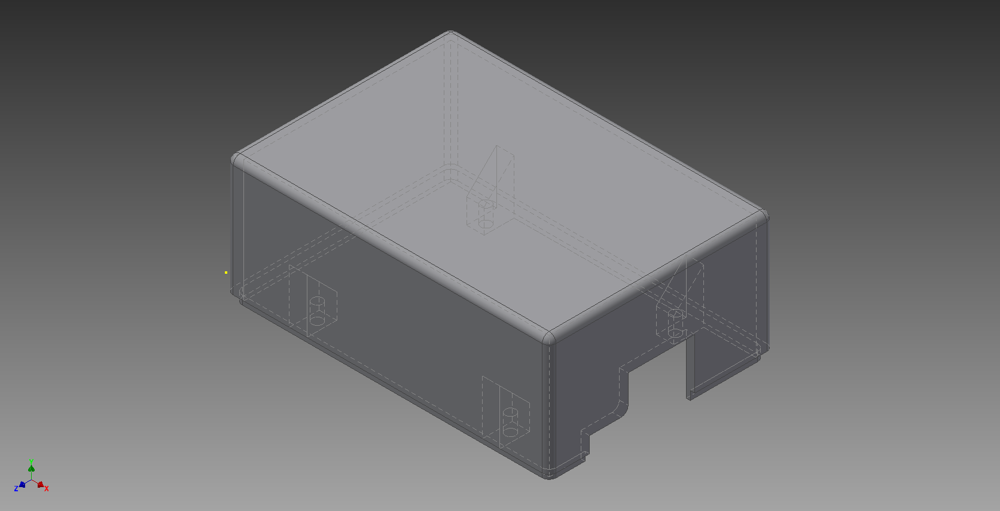

<<<<<<< Updated upstream

[toc]

##Manufacture / Casing [cont.](#contents)
=======
##Manufacture / Casing

[Back to contents](#contents)
>>>>>>> Stashed changes

###Initial Research

The project required us to have hardware in the real world meaning that it has to be able to survive in the environment that it is deployed in. We couldn't simply deploy the electronics because they would get damaged. Therefor we have to house all of our pieces of hardware in some form of casing.

There are a few ways to make cases, they include making a custom 3D model of the object and sending it to companies to either be 3D printed, a process where plastic is melted and printed in layers to form the intended 3 dimensional object. Alternatively, injection moulding, a process where a mould is made of the object intended to be created then melted plastic fills the negative space in the mould leaving the object when it has hardened. 

Injection moulding creates a rigid plastic shell when hardened as the piece comes from liquid plastic that hardens into one piece whereas 3D printed pieces can be more brittle as the plastic dries on when each layer is added meaning it can leave pores on the final product.

There are companies that offer custom 3D printing and injection moulding such as [Shapeways](http://www.shapeways.com/) (3D printing) and [Protolabs](http://www.protolabs.co.uk/) (3D printing and injection moulding). The main issues with these places is the cost and time it would take to get an object back. We would have to design the object we want created, each piece is individually quoted, it would be created and we would have to wait for it to arrive. In the case of injection moulding Protolabs have a minimum of 25 parts from one mould, meaning it would be more expensive than 3D printing. If there was a mistake in a 3D model we would have wasted time and money and still have to print another one.

Although, The Shed has specific software for 3D modelling and a 3D printer that we can use for prototyping and final printing of our cases. It is possible to quickly print a prototype and test a design multiple times and print a final when we are happy with it. 

####Conclusion

We decided to use the Sheds facilities to create our cases. It will be much more cost efficient as we do not have to pay for each individual print and the turn around of each piece is much quick as we do not have to wait for it to be posted.

###Hub Case

All 3D models for this section can be found [here](Manufacture/hub)

####Description

The Hub case is 3D printed. It was designed to hold the Raspberry Pi in place through the use of screws and nuts. It is also designed in a manner that made it easy to open incase there were any problems while the hub was deployed. The case comes in two parts, the lid and the base.

The case is meant to be easily modifiable. So that if there are any changes that need to be made it is easy enough to change the 3D model and print off a new one that fits the purpose better.

*Base*

The base is made to be 2mm thick on the longer sides for strength and rigidity. It was made to be slightly bigger than the Raspberry Pi model B+ (5mm in every direction but the one with the ethernet connection). It has holes in the bottom big enough for 2.5mm fixings to fit through both the case and the board using nuts to hold it in place so that the board is secure inside.

There are two grooves on the longer sides of the base, inside the base, that allow the lid to click into place.

*Lid* 

The lid is designed to be reversible for ease of use. The longer sides of the lid has sections that sit inside the base. These sections are as long as the inside of the base so that it does not slide around when fitted. These extruded sections have further extruded lines that click into the grooves on the base. To remove the lid squeeze the sides and pull off. It was designed in this way for ease of access.

Pictures pf both:

#####Refinements

If we were to make this case better we would try and make the lid more secure, we could also try and make the case look more appealing.

####Previous Work

#####Base - Iteration 1 - Initial Version.

The FRDM K64F board had no technical specifications that could be found meaning we did not have the measurements for it. Therefore it had to be measured by eye using rulers and electronic calipers. 

As this is the fist time we would be 3D printing anything we had no reference for how strong the result would be. We decided to measure the thickness of the calipers box as that seemed to be quite a strong (2.5mm).

We decided to model the bottom half of the case first. This was done because it was the smaller of the two pieces of the case, we could reprint a new one quickly if there was anything wrong with this one. We wanted the board to be secure in the case so the we designed it in a way that the base, lid and board had holes that lined up so 3mm fixings could be screwed through all three and secured together.

When designing the case the idea was to have part of the edge extrude further than the rest to create a lip so that the lid could sit inside. 

######Outcomes of iteration

We 3D printed our first object, learnt how to use the software properly.

#####Base - Iteration 2 - Changing the size and some positioning

######Issues with Previous Iteration

After printing the first iteration we found that the base was slightly too tight for the board, the position of the cutout for the usb and ethernet ports were not big enough and one of the holes was out by ≈2mm.

######Outcomes of Iteration

We reprinted the base of the case with the adjustments specified by the problems with the previous iteration. 2.5mm was added around all edges to make the board fit better, the cutout was made bigger so that usb and ethernet cables would fit and the distance for the hole was remeasured and moved by 2mm.

#####Base - Iteration 3 - Moving the hole

######Issues with Previous Iteration

The hole was still out by ≈2mm. Also the prints were taking longer than expected so we decided we should reduce it, in an attempt to keep the strength but reduce printing time and the cutout for the cables was now a little too big.

######Outcomes of Iteration

We reprinted the base moving the hole by 2mm and reducing the thickness of the bottom of the base by 1mm. We made hole smaller for the cable by 3mm.

Hub base comparison, iteration 1 to 3

#####Lid - Iteration 1 - Initial version

The idea behind the lid is that there are structures inside that line up with the holes in the base and the board that sit on top of the board to hold it down when the case is fixed together. These structures start by coming out of the side of the case by 45 degrees until it reaches 8.5mm to the rectangles that the fixings will go into, these are because of the way the lid will be printed. It will be printed upside down, they remove overhang because the 3D printer cant print on to blank space.

Also, the lid has to be tall enough for the FRDM board, the shield and an XBee to fit inside. The lid also had to have a cut out in it big enough for a power cable to fit and an ethernet cable.

######Outcomes of iteration

The first iteration of the lid was printed. 

#####Lid - Iteration 2 - Rounding the corners

######Issues with Previous Iteration

we found that it didn't fit in its intended base as the corners that were printed were too tight. This is because in Base - Iteration 3 there were some plastic artefacts (misprints) left from its printing.

A problem arose when the lid was tested, putting the board in with the shield on as well was not considered. Although the height was, the added size of the shield meant that it did not fit in the gap between the structures inside that were meant to hold the board in place.

######Outcomes of iteration

We reprinted the lid, rounding the corners that would sit inside Base - Iteration 3. And, because the hole was still ≈1mm out for the fixing it was moved by 1mm.

We decided not to remove the structures because we did not really need the shield, we could wire the XBee in directly.

#####Base - Iteration 4 - moving the hole again

######Issues with Previous Iteration

The hole was still out by ≈1mm. Although fixing still fit so this is just if we want to reprint to make the fit better.

######Outcomes of the Iteration

The design for the base is created but we haven't printed it. It would fit with Lid - Iteration 2.

Printed parts put together:

#####Base - Iteration 5 - Raspberry Pi Version 1

The board we are using for the hub changed to a Raspberry Pi Model B+. Unlike the FRDM board the Raspberry Pi is well documented and has [dimensions](https://www.raspberrypi.org/documentation/hardware/raspberrypi/mechanical/Raspberry-Pi-B-Plus-V1.2-Mechanical-Drawing.pdf) available.

The case has holes in the base big enough for 2.5mm fixings and nuts to hold the board in place, and section cut out of one side for the ethernet and usb ports. It has slits in the side for the lid to lock into.

######Outcomes of Iteration

The first version of the base was printed.

#####Lid - Iteration 3 - Raspberry Pi Version 1

The lid was designed to sit on top of the base with two extruding parts on the longer sides of the case, with parts on them that clip into holes in the inside of the base.

######Outcomes of Iteration

The first version of the lid was printed.

#####Base - Iteration 6 - Adding power cutout

######Issues with Previous Iteration

When the base was printed it was realised that a cut out for the power cable was not present. Also that the walls were slightly too thin, they were not sturdy enough to hold the inserts form the lid that were meant to clip inside.

######Outcomes of Iteration

The base was reprinted with a cutout for the power cable and the walls were made thicker.

#####Lid - Iteration 4 - Made to match base

######Issues with Previous Iteration

There were no issues as such, this is just so that the wall thickness matches with the new base so the edges sit flush.

######Outcomes of Iteration

The lid was reprinted with the walls made thicker to match the base.

 

###Sensor Case

All 3D models for this section can be found [here](Manufacture/sensor)

####Description

The sensor case is 3D printed to hold the sensor components. It needs to hold the board we are using, a LiPo battery and a breadboard with a clock, ADC and an XBee. Also it had to have a hole in the exterior for the microphone to point out of. 

The case Is made of two parts. The top is a rectangular box with half of an interlocking system that is fitted with a neoprene strip to stop water from getting into the case.

The other half of the case has the part of the interlocking system that the top fits in. One of the smaller faces is at a 45 degree angle with a hole in it for the microphone so that it can be pointed towards the ground from up high. The face at an angle also has a cover which is at a 90 degree angle form that so that if any water hits it, it will run off away from the electronics.

Both parts have been sprayed with a high fill primer to fill any pores left from the printing process to make them splash proof.

#####Refinements

To further the sensor case we would like to make the mic fully directional so that a customer can angle it in the direction they think the noise is coming form. We could do this by putting the mic in a separate part of the case attached by something like a ball and socket joint.

We would also like to add a charging port. To make the sensor weatherproof the case had to be fully closed. To make the device easier to charge we would look into a way that we would have the charging port accessible but maintain the cases water resistance.

####Previous Work

#####Mic end - Iteration 1 - Version 1

The case has to be big enough to fit an arduino, an arduino shield with a clock and an SD card reader on it. It also has a hole for the microphone to face out of to make the microphone directional. The case is designed to have an interlocking system where the two parts that fit together. There are also structures on the outside of the case that will lock into the other part of the case, they have holes that are 3mm in diameter so that screws can lock them together. Inside there are runners that the board will sit under so that it does not move around and a stop at the end that it will rest against and the microphone will sit on. 

The microphone has to fit snugly in the hole it pokes out of in case so that it doesn't move around or fall out while it is deployed. To know what size the hole in the case should be we made a gauge for it. Measuring the microphone at 10mm we modelled the gauge with three holes n it the went down in increments of 1mm to 9.8mm.

######Outcomes of Iteration

After printing the gauge we found that the mic best fit in the 9.9mm hole.

From there we modified the 3D model of the case to match the hole size and then printed it.

#####Power end - Iteration 1 - Version 1

This half of the case was modelled to interlock with the mic end of the case. This side ed of the case also has rails for the board to sit under and a stopper at the end. When the case is closed the board should just fit inside the space between the two stoppers so that it doesn't move around. There is also a cut out that is large enough for a usb b cable to fit in for the power connection.

######Outcomes of Iteration

The case was printed. It was then tested to see if the two parts interlocked, the board fit in well, if the mic fit, the usb hole was in the right place and there was enough room for the cable.

#####Mic and Power end - Iteration 2 - Modified rails

######Issues with Previous Iteration

The mic and power end of the case fit well, they interlocked, the mic fit, the usb cable was able to be connecter and the board fit. Although the rails were did not work as well as expected, they caught on the headers of the arduino. They were made smaller and moved down so the board slid under them better and fit snugly.

######Outcomes of Iteration

Both parts were reprinted.

#####Sensor Version 2 - Iteration 1 - Waterproofing

This version of the sensor has to be outside. Therefore before designing the case we looked at waterproofing.

The problem with 3D printed plastic is that it is very porous. So even with 100% infill water can still seep through if it sits on the surface long enough. So to test waterproofing a 3D print we modelled a small box. 

We are testing waterproofing by spraying the box with a high fill primer usually used before painting to fill any holes in walls. The reason for this is that the box does not have to be fully submergible, it has to be weatherproof so spraying the box with the primer will fill the pores left from the printing process and water wont be able to seep in. The box has 1mm thick walls to test the thinnest they can be it will be printed at 100% infill with an extra .4mm on the outside to allow it to be sanded. The box will have to be sanded before printed to create a rough surface for the primer to adhere to.

Where the two parts fit together there is an interlocking system where one part sits inside the other. There are recessed sections inside this interlocked part that allows room for a rubber seal to be fitted. The interlocking part of the case should stop water getting in but the seal will incase water does seep in. We have chosen a neoprene rubber strip as our seal as it is what is used in wetsuits and is waterproof.

######Outcomes of Iteration

Both parts of the box were printed, they were sanded, sprayed with the high fill primer and fitted with the neoprene seal.

To test to see if the box was waterproof or not we filled it with coins to weigh it down and a scrunched up piece of paper (something absorbent). We closed the box, screwed it up and submerged it in a bowl of water to see if it was fully waterproof.

We left it in the bowl for 20 minutes. When we removed it and looked at the contents they were not wet, it looked like no water had got inside. So we shall use this method to waterproof our sensor that will be deployed outside.

#####Sensor Version 2 - Iteration 2 - Modelling case

The case was designed in the same way the the waterproof box was. It was a modified version that was designed to fit all of our electronics.

A key feature of the case is the the directionality of the microphone, as we will be deploying the microphone on the second story of a building the microphone needs to point towards the street to capture as much sound as possible. To do this we built the bottom half of the case with an edge at a 45 degree angle with a hole in it to hold the microphone. Because the microphone will be partially on the outside of the case we don't want it to get wet so we made an angled cover that extrudes and acts as an umbrella so that rain cant get to the microphone and short our electronics.

We thought that it would be good to separate the components inside the case so we made a separator that the board could sit on with the battery underneath.

######Outcomes of Iteration

The case was printed. It was sanded, sprayed and fit with a neoprene strip to make it waterproof. The separator was not printed.

#####Sensor Version 2 - Iteration 3 - Reprint

######Issues with Previous Iteration

The top of the case did not fit wit the bottom, it was out by 2mm

######Outcomes of Iteration

The top was reprinted, it was checked that it fit. It was then sanded, sprayed and fitted with a neoprene strip.

###Clock Case

All 3D models for this section can be found [here](Manufacture/clock)

####Description

The clock case has to house an arduino flora and a XBee while holding but displaying a neopixel ring.

The case was designed in multiple parts, the housing for the neopixel ring had to be big enough for the ring to sit in and have a way of putting the wires indie to hide them. On the back of the face piece there is a raised ring, slightly bigger than the flora where that sits. On the sides of the face there are two extruded parts that slide over the back piece with holes that line up to secure the pieces together.

The back piece of the clock is simple housing, it is big enough for wires and an XBee to fit in. It also has a cut out in the side big enough for the power cable for the flora to fit. There is also a triangular stand built into the case so that it can be placed on a flat surface.

The clock needed a face to cover the ring so that it is displayed but still protected. The face is made of two laser cut pieces of clear plastic. To diffuse the light coming from the neopixel ring a piece of paper is put in between the two face pieces of plastic.

To hold the faces against the case, two fixings were cut out of clear plastic that had holes in them that lined up with the holes in the case so that they could all be screwed together

#####Refinements

The clock design is quite good we feel, the only thing we would like to do is refine the look and maybe make the device smaller.

####Previous Work

#####Iteration 1 - Initial Design

A basic 3D design of the clock was made in Google Sketch Up, that outlined how the case might look. That can be found [here](#designs)

######Outcomes of Iteration

An idea of what the clock could look like was made, and measurements of the parts were taken.

#####Iteration 2 - Translating the design

######Issues with Previous Iteration

The design did not take into account where the wires would go, where the power wire would fit or how the parts would be put together.

######Outcomes of Iteration

The design was made in Inventor, using the idea from the previous iteration. The neopixel ring was wired to the flora with a connector that meant the two could be separated, this meant that the ring could sit on the front with the wires threaded through a hole and re connected to the flora on the other side meaning when the case is closed the flora would be on the inside of the case where it stays hidden. On the side the flora sits there is a raised ring that is for the flora to clip into with a section being cut out so that the power wire could be connected.

The two pieces of the case had to be fixed together as well so on the face part there are extruded parts that slide over the back where holes line up so they can be screwed together. Extra fixings had to be cut out that also line up with these holes to hold the face against the case.

The two parts for the case were printed, two faces were laser cut along with their fixings. A piece of paper was cut to put in between the two faces to diffuse the light from the neopixel ring.

